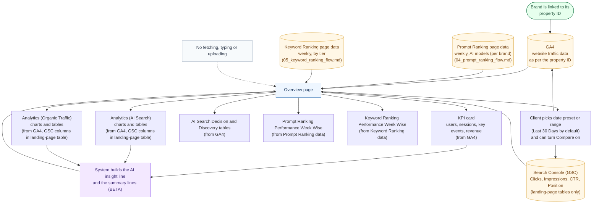
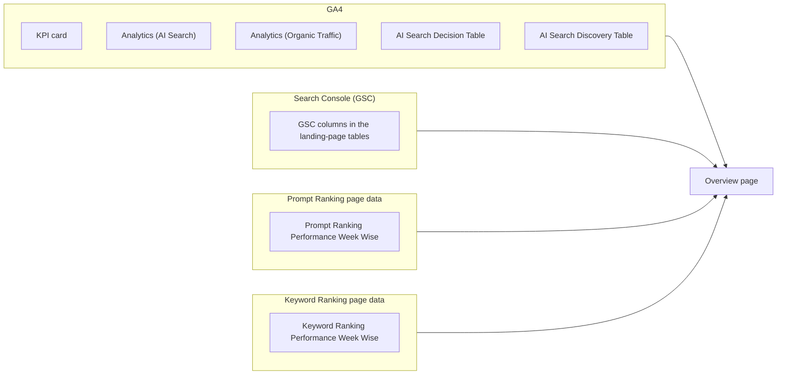

# Overview Flow

## 1. Overall journey

```mermaid
flowchart TD
    P(["Brand is linked to its<br/>property ID"])
    P --> GA[("GA4<br/>website traffic data<br/>as per the property ID")]

    GSC[("Search Console (GSC)<br/>Clicks, Impressions, CTR, Position<br/>(landing-page tables only)")]
    PR[("Prompt Ranking page data<br/>weekly, AI models (per brand)<br/>(04_prompt_ranking_flow.md)")]
    KR[("Keyword Ranking page data<br/>weekly, by tier<br/>(05_keyword_ranking_flow.md)")]

    GA --> PG["Overview page"]
    GSC --> PG
    PR --> PG
    KR --> PG

    PG --> B1["KPI card<br/>users, sessions, key events, revenue<br/>(from GA4)"]
    PG --> B2["Analytics (AI Search)<br/>charts and tables<br/>(from GA4, GSC columns in landing-page table)"]
    PG --> B3["Analytics (Organic Traffic)<br/>charts and tables<br/>(from GA4, GSC columns in landing-page table)"]
    PG --> B4["AI Search Decision and Discovery tables<br/>(from GA4)"]
    PG --> B5["Prompt Ranking Performance Week Wise<br/>(from Prompt Ranking data)"]
    PG --> B6["Keyword Ranking Performance Week Wise<br/>(from Keyword Ranking data)"]

    B1 --> AI["System builds the AI insight line<br/>and the summary lines (BETA)"]
    B2 --> AI
    B3 --> AI
    AI --> PG

    PG --> M["Client picks date preset or range<br/>(Last 30 Days by default)<br/>and can turn Compare on"]
    M --> GA
    M --> GSC

    N["No fetching, typing or uploading"] -.-> PG

    classDef ext fill:#fff7e6,stroke:#d69e2e,color:#744210
    classDef stage fill:#eef6ff,stroke:#2b6cb0,color:#1a365d
    classDef done fill:#e6ffed,stroke:#2f855a,color:#22543d
    classDef ai fill:#f3e8ff,stroke:#7c3aed,color:#44337a
    classDef note fill:#f7fafc,stroke:#a0aec0,color:#2d3748
    class GA,GSC,PR,KR ext
    class PG stage
    class P done
    class AI ai
    class N note
```

## 2. Where each block comes from

```mermaid
flowchart LR
    subgraph G["GA4"]
        direction TB
        X1["KPI card"]
        X2["Analytics (AI Search)"]
        X3["Analytics (Organic Traffic)"]
        X4["AI Search Decision Table"]
        X5["AI Search Discovery Table"]
    end
    subgraph GS["Search Console (GSC)"]
        direction TB
        W1["GSC columns in the landing-page tables"]
    end
    subgraph PRP["Prompt Ranking page data"]
        direction TB
        Y1["Prompt Ranking Performance Week Wise"]
    end
    subgraph KRP["Keyword Ranking page data"]
        direction TB
        Z1["Keyword Ranking Performance Week Wise"]
    end
    G --> PAGE["Overview page"]
    GS --> PAGE
    PRP --> PAGE
    KRP --> PAGE
```

