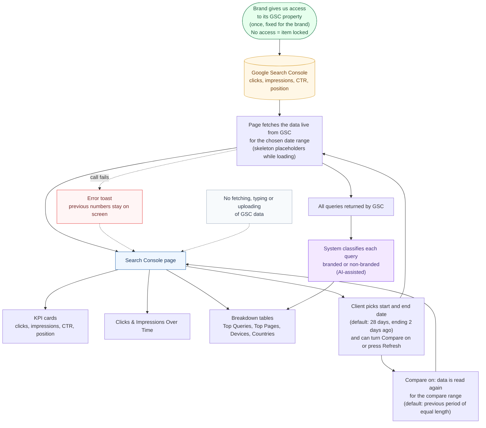

# Search Console Flow

## 1. Overall journey

```mermaid
flowchart TD
    P(["Brand gives us access<br/>to its GSC property<br/>(once, fixed for the brand)<br/>No access = item locked"])
    P --> GSC[("Google Search Console<br/>clicks, impressions, CTR, position")]

    GSC --> F["Page fetches the data live from GSC<br/>for the chosen date range<br/>(skeleton placeholders while loading)"]
    F --> PG["Search Console page"]

    PG --> K["KPI cards<br/>clicks, impressions, CTR, position"]
    PG --> CH["Clicks & Impressions Over Time"]
    PG --> TB["Breakdown tables<br/>Top Queries, Top Pages, Devices, Countries"]

    F --> Q["All queries returned by GSC"]
    Q --> CL["System classifies each query<br/>branded or non-branded<br/>(AI-assisted)"]
    CL --> TB

    PG --> D["Client picks start and end date<br/>(default: 28 days, ending 2 days ago)<br/>and can turn Compare on or press Refresh"]
    D --> F

    D --> CMP["Compare on: data is read again<br/>for the compare range<br/>(default: previous period of equal length)"]
    CMP --> PG

    F -. "call fails" .-> ERR["Error toast<br/>previous numbers stay on screen"]
    ERR -.-> PG

    N["No fetching, typing or uploading<br/>of GSC data"] -.-> PG

    classDef ext fill:#fff7e6,stroke:#d69e2e,color:#744210
    classDef stage fill:#eef6ff,stroke:#2b6cb0,color:#1a365d
    classDef done fill:#e6ffed,stroke:#2f855a,color:#22543d
    classDef ai fill:#f3e8ff,stroke:#7c3aed,color:#44337a
    classDef note fill:#f7fafc,stroke:#a0aec0,color:#2d3748
    classDef err fill:#fff5f5,stroke:#e53e3e,color:#742a2a
    class GSC ext
    class PG stage
    class P done
    class CL ai
    class N note
    class ERR err
```

