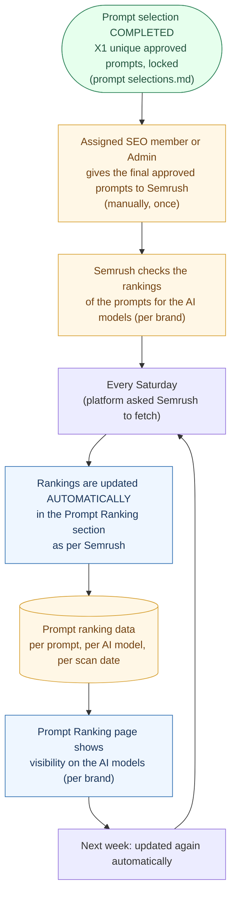
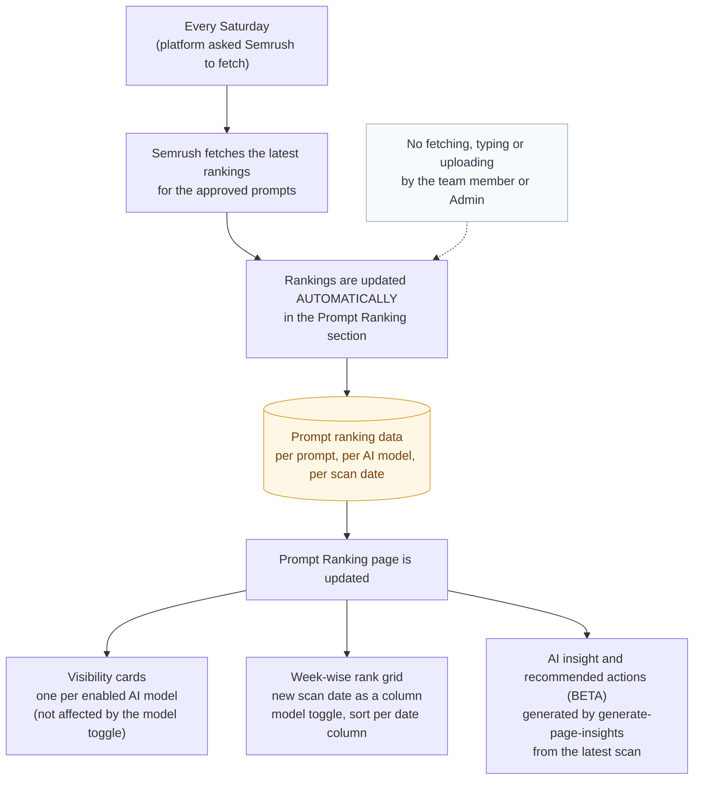

# Prompt Ranking Flow

## 1. Overall journey

```mermaid
flowchart TD
    A(["Prompt selection COMPLETED<br/>X1 unique approved prompts, locked<br/>(prompt selections.md)"]) --> G["Assigned SEO member or Admin<br/>gives the final approved prompts to Semrush<br/>(manually, once)"]
    G --> S["Semrush checks the rankings<br/>of the prompts for the AI models (per brand)"]
    S --> W["Every Saturday<br/>(platform asked Semrush to fetch)"]
    W --> U["Rankings are updated AUTOMATICALLY<br/>in the Prompt Ranking section<br/>as per Semrush"]
    U --> D[("Prompt ranking data<br/>per prompt, per AI model, per scan date")]
    D --> PG["Prompt Ranking page shows<br/>visibility on the AI models (per brand)"]
    PG --> NEXT["Next week: updated again automatically"]
    NEXT --> W

    classDef ext fill:#fff7e6,stroke:#d69e2e,color:#744210
    classDef store fill:#fff7e6,stroke:#d69e2e,color:#744210
    classDef stage fill:#eef6ff,stroke:#2b6cb0,color:#1a365d
    classDef done fill:#e6ffed,stroke:#2f855a,color:#22543d
    class G,S ext
    class D store
    class U,PG stage
    class A done
```

## 2. Automatic weekly update

```mermaid
flowchart TD
    W["Every Saturday<br/>(platform asked Semrush to fetch)"] --> SEM["Semrush fetches the latest rankings<br/>for the approved prompts"]
    SEM --> A["Rankings are updated AUTOMATICALLY<br/>in the Prompt Ranking section"]
    A --> D[("Prompt ranking data<br/>per prompt, per AI model, per scan date")]
    D --> P["Prompt Ranking page is updated"]

    P --> P1["Visibility cards<br/>one per enabled AI model<br/>(not affected by the model toggle)"]
    P --> P2["Week-wise rank grid<br/>new scan date as a column<br/>model toggle, sort per date column"]
    P --> P3["AI insight and recommended actions (BETA)<br/>generated by generate-page-insights<br/>from the latest scan"]

    N["No fetching, typing or uploading<br/>by the team member or Admin"] -.-> A

    classDef store fill:#fff7e6,stroke:#d69e2e,color:#744210
    classDef note fill:#f7fafc,stroke:#a0aec0,color:#2d3748
    class D store
    class N note
```

