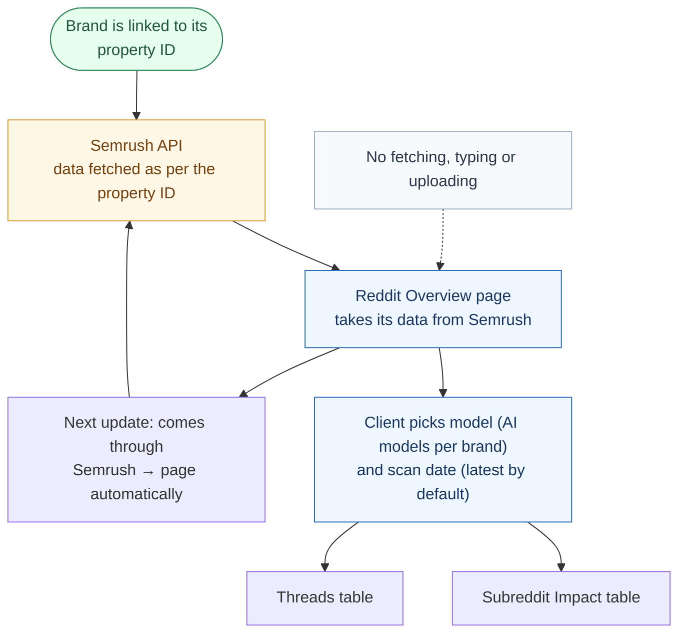

# Reddit Overview Flow

## 1. Overall journey

```mermaid
flowchart TD
    P(["Brand is linked to its<br/>property ID"])
    P --> S["Semrush API<br/>data fetched as per the property ID"]
    S --> PG["Reddit Overview page<br/>takes its data from Semrush"]

    PG --> SEL["Client picks model (AI models per brand)<br/>and scan date (latest by default)"]
    SEL --> T1["Subreddit Impact table"]
    SEL --> T2["Threads table"]

    PG --> NEXT["Next update: comes through<br/>Semrush → page automatically"]
    NEXT --> S

    N["No fetching, typing or uploading"] -.-> PG

    classDef ext fill:#fff7e6,stroke:#d69e2e,color:#744210
    classDef stage fill:#eef6ff,stroke:#2b6cb0,color:#1a365d
    classDef done fill:#e6ffed,stroke:#2f855a,color:#22543d
    classDef note fill:#f7fafc,stroke:#a0aec0,color:#2d3748
    class S ext
    class P,PG,SEL stage
    class P done
    class N note
```

