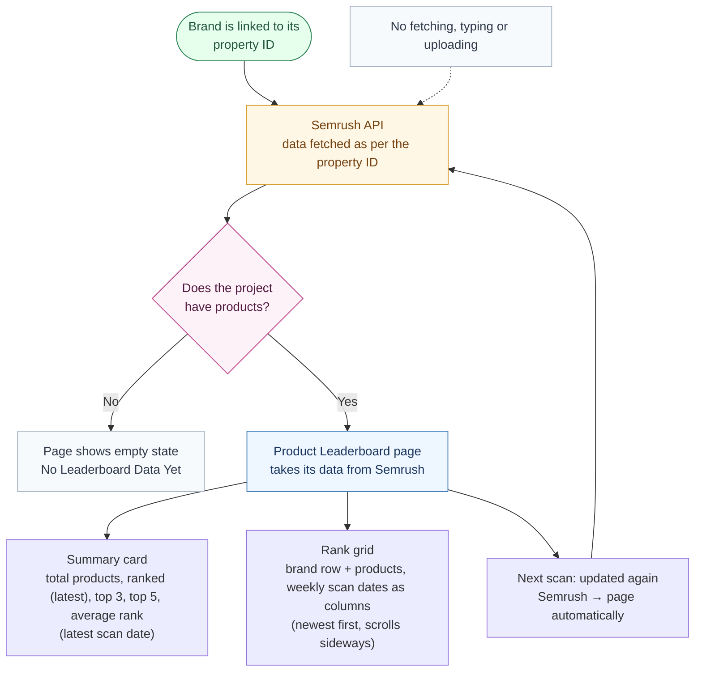

# Product Leaderboard Flow

## 1. Overall journey

```mermaid
flowchart TD
    A(["Brand is linked to its<br/>property ID"]) --> S["Semrush API<br/>data fetched as per the property ID"]
    S --> Q{"Does the project<br/>have products?"}
    Q -->|"No"| EM["Page shows empty state<br/>No Leaderboard Data Yet"]
    Q -->|"Yes"| PG["Product Leaderboard page<br/>takes its data from Semrush"]

    PG --> P1["Summary card<br/>total products, ranked (latest), top 3, top 5, average rank<br/>(latest scan date)"]
    PG --> P2["Rank grid<br/>brand row + products, weekly scan dates as columns<br/>(newest first, scrolls sideways)"]

    PG --> NEXT["Next scan: updated again<br/>Semrush → page automatically"]
    NEXT --> S

    N["No fetching, typing or uploading"] -.-> S

    classDef ext fill:#fff7e6,stroke:#d69e2e,color:#744210
    classDef decision fill:#fdf2f8,stroke:#b83280,color:#521b41
    classDef stage fill:#eef6ff,stroke:#2b6cb0,color:#1a365d
    classDef done fill:#e6ffed,stroke:#2f855a,color:#22543d
    classDef note fill:#f7fafc,stroke:#a0aec0,color:#2d3748
    class S ext
    class Q decision
    class PG stage
    class A done
    class N,EM note
```

