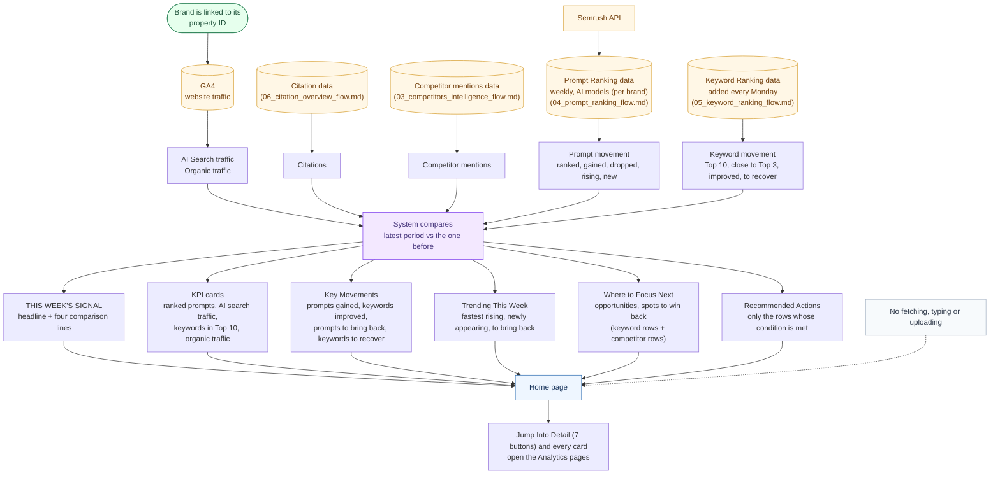
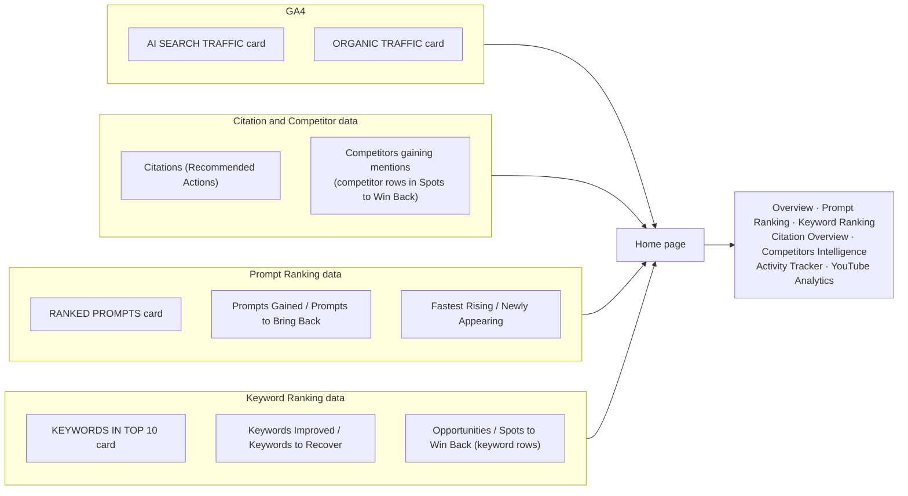

# Home Flow

## 1. Overall journey

```mermaid
flowchart TD
    P(["Brand is linked to its<br/>property ID"])
    P --> GA[("GA4<br/>website traffic")]

    PR[("Prompt Ranking data<br/>weekly, AI models (per brand)<br/>(04_prompt_ranking_flow.md)")]
    KR[("Keyword Ranking data<br/>added every Monday<br/>(05_keyword_ranking_flow.md)")]
    CIT[("Citation data<br/>(06_citation_overview_flow.md)")]
    CMD[("Competitor mentions data<br/>(03_competitors_intelligence_flow.md)")]
    SEM["Semrush API"] --> PR

    GA --> T["AI Search traffic<br/>Organic traffic"]
    CIT --> C["Citations"]
    CMD --> CM["Competitor mentions"]
    PR --> PM["Prompt movement<br/>ranked, gained, dropped, rising, new"]
    KR --> KM["Keyword movement<br/>Top 10, close to Top 3, improved, to recover"]

    T --> CMP["System compares<br/>latest period vs the one before"]
    C --> CMP
    CM --> CMP
    PM --> CMP
    KM --> CMP

    CMP --> H["THIS WEEK'S SIGNAL<br/>headline + four comparison lines"]
    CMP --> K["KPI cards<br/>ranked prompts, AI search traffic,<br/>keywords in Top 10, organic traffic"]
    CMP --> KMV["Key Movements<br/>prompts gained, keywords improved,<br/>prompts to bring back, keywords to recover"]
    CMP --> TR["Trending This Week<br/>fastest rising, newly appearing, to bring back"]
    CMP --> FN["Where to Focus Next<br/>opportunities, spots to win back<br/>(keyword rows + competitor rows)"]
    CMP --> RA["Recommended Actions<br/>only the rows whose condition is met"]

    H --> HOME["Home page"]
    K --> HOME
    KMV --> HOME
    TR --> HOME
    FN --> HOME
    RA --> HOME

    HOME --> J["Jump Into Detail (7 buttons) and every card<br/>open the Analytics pages"]

    N["No fetching, typing or uploading"] -.-> HOME

    classDef ext fill:#fff7e6,stroke:#d69e2e,color:#744210
    classDef stage fill:#eef6ff,stroke:#2b6cb0,color:#1a365d
    classDef done fill:#e6ffed,stroke:#2f855a,color:#22543d
    classDef calc fill:#f3e8ff,stroke:#7c3aed,color:#44337a
    classDef note fill:#f7fafc,stroke:#a0aec0,color:#2d3748
    class GA,PR,KR,SEM,CIT,CMD ext
    class HOME stage
    class P done
    class CMP calc
    class N note
```

## 2. Where each section gets its data

```mermaid
flowchart LR
    subgraph GAS["GA4"]
        direction TB
        A1["AI SEARCH TRAFFIC card"]
        A2["ORGANIC TRAFFIC card"]
    end
    subgraph CDS["Citation and Competitor data"]
        direction TB
        A3["Citations (Recommended Actions)"]
        A4["Competitors gaining mentions<br/>(competitor rows in Spots to Win Back)"]
    end
    subgraph PRS["Prompt Ranking data"]
        direction TB
        B1["RANKED PROMPTS card"]
        B2["Prompts Gained / Prompts to Bring Back"]
        B3["Fastest Rising / Newly Appearing"]
    end
    subgraph KRS["Keyword Ranking data"]
        direction TB
        C1["KEYWORDS IN TOP 10 card"]
        C2["Keywords Improved / Keywords to Recover"]
        C3["Opportunities / Spots to Win Back (keyword rows)"]
    end
    GAS --> HOME["Home page"]
    CDS --> HOME
    PRS --> HOME
    KRS --> HOME
    HOME --> PAGES["Overview · Prompt Ranking · Keyword Ranking<br/>Citation Overview · Competitors Intelligence<br/>Activity Tracker · YouTube Analytics"]
```

